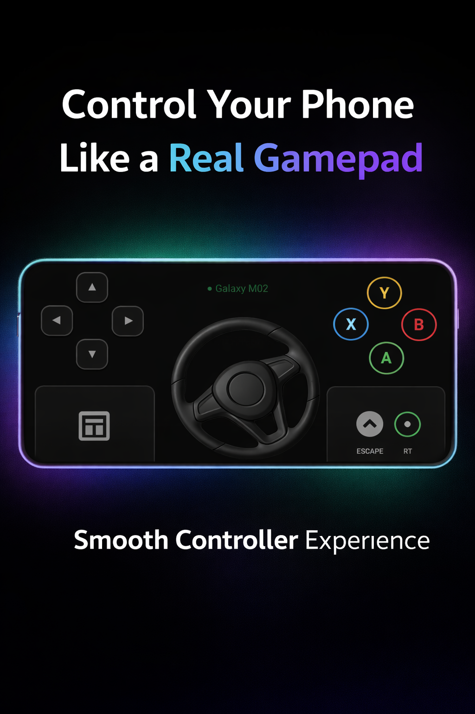
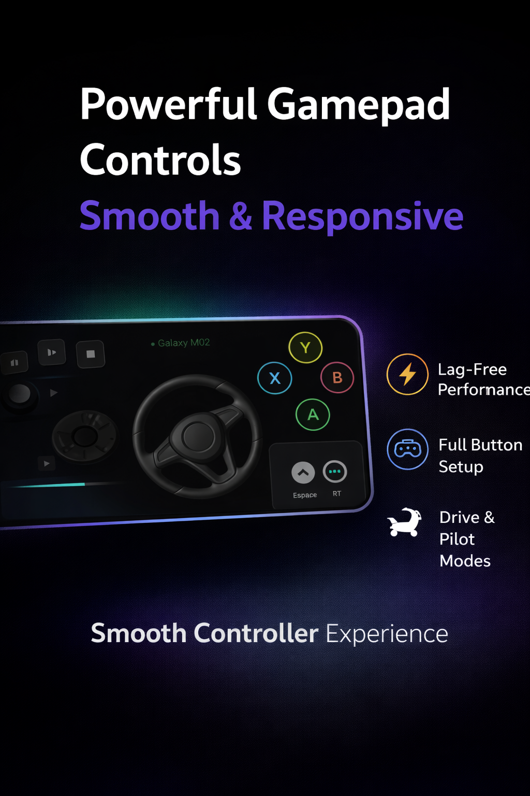
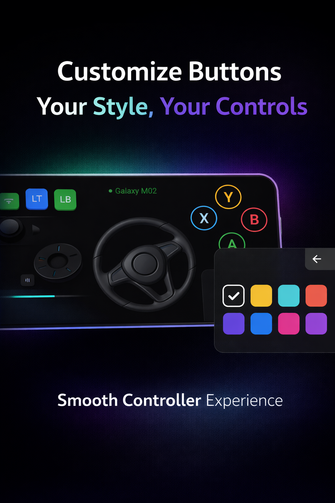

# 🎮 Mrb Gamepad Pro

**Transform Your Android Device into a High-Performance Virtual Bluetooth Controller**

Mrb Gamepad Pro leverages standard Bluetooth HID Profiles to turn your phone into a zero-latency gamepad. Perfect for PC Emulation (Winlator, Mobox, GameHub) and heavy titles like GTA V and Forza Horizon 5.

---

## ⚡ Key Features

* **Low-Latency HID Profile:** Connects instantly as a native Bluetooth controller, requiring no third-party server apps on your PC.
* **Analog Tilt Steering (Kill-Switch Enabled):** Precision gyroscope-to-joystick mapping for racing games, with a dedicated hard-lock kill-switch to prevent data leaks when disabled.
* **Dynamic Custom UI:** Fully customizable button layouts. Drag, drop, resize, and save your preferred controls with a sleek, Material 3 inspired expressive interface.
* **Background Execution:** Keeps the controller alive and connected even when the screen is off or the app is running in the background.

---

## Screenshots

  
  
  

##  Architecture & Tech Stack

This project is built with performance and clean architecture in mind:

* **Language:** Kotlin
* **Core API:** `BluetoothHidDevice` (Android SDK)
* **UI/UX:** Dynamic FrameLayouts with custom TouchListeners and programmatic Canvas rendering.
* **Sensor Logic:** Highly optimized `SensorManager` event handling with custom low-pass filters to eliminate hardware jitter.

---

## How to Use

1. **Install:** Download the latest release from the [APKPure Store](#) or [uptodown store](#)
2. **Pair Device:** Pair your Android device to your PC or target device via Bluetooth.
3. **Launch:** Open Mrb Gamepad Pro, allow Bluetooth permissions, and tap the status bar to initiate the HID connection.
4. **Customize:** Tap the Crown icon to enter Edit Mode, arrange your UI, and toggle the Tilt sensor as needed.

---

## 🤝 Contributing

Contributions, issues, and feature requests are welcome! Feel free to check the [issues page](#) if you want to contribute.

## 📝 License

This project is [MIT](https://opensource.org/licenses/MIT) licensed.

  Developed with ❤️ by <b>Mrb</b>

